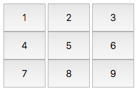
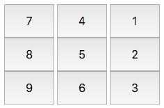

#Buttons Container

##Objective 
In this challenge, we use the <div> tag to create buttons in a grid.

##Resources 
Check out the Tutorial tab to learn more about using the ```<div>``` tag.

##Task 
Create nine buttons laid out in a 3×3 grid, like so: 

  

The id for the button container ```<div>``` is btns.  
The id for the button with text 1 is btn1.  
The id for the button with text 2 is btn2.  
The id for the button with text 3 is btn3.  
The id for the button with text 4 is btn4.  
The id for the button with text 5 is btn5.  
The id for the button with text 6 is btn6.  
The id for the button with text 7 is btn7.  
The id for the button with text 8 is btn8.  
The id for the button with text 9 is btn9.  
The width of the button container is 75% relative to the document body width.  
The width of each button is 30% relative to the buttons container width and their height is 48px.  
The font size of each button is 24px.  

Every time button 5 is clicked, the text displayed on each button in the outer grid are rotated in a clockwise direction (see the Example below). The button ids are never updated.

##Example

Initially, the buttons' text are: 

  

After clicking the button 5: 

  

After clicking the button 5 one more time: 

  

##Note

The js and css files are in different directories, so use the ```<link>``` tag to provide the path of the css file and ```<script>``` tag to provide the path of the js file:

```html
<!DOCTYPE html>
<html>
    <head>
        <link rel="stylesheet" href="css/buttonsGrid.css" type="text/css">
    </head>
    
    <body>
    	<script src="js/buttonsGrid.js" type="text/javascript"></script>
    </body>
</html>
```

