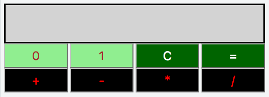

#Binary Calculator

##Objective 
In this challenge, we create a calculator with buttons that performs binary operations.

##Task

Create a calculator that performs the following binary number operations: addition, subtraction, multiplication, and division. The calculator must look like this: 

  

  + Use a ```<div id="res">``` to display the results of the calculations. The background color is lightgray. The border is solid as per CSS property values. Set the width to 81% and the height to 48px. The font size is 20px.

  + Use a ```<div id="btns">``` as a button container that displays all eight buttons. The width of the container is 90%.

  + The id of button 0 is btn0, and button 1 is btn1. The background color is lightgreen, and the text color is brown for both the 0 and 1 buttons. These buttons are used to input binary numbers.

  + The id of button C is btnClr, and button = is btnEql. The background color is darkgreen, and the text color is white for both the C and = buttons. Here, C is used to clear the result, and = is used to get the expression value.

  + The id of button + is btnSum, and button - is btnSub. The id of button * is btnMul, and button / is btnDiv. The background color is black, and the text color is red for all these buttons. These buttons are the operators.

  + The width of each button is 22%, the height is 36px and the font size is 18px.

##Assumption

  + All the expressions will be in the form: operand1 operator operand2. Here, operand1 is the first binary number, operand2 is the second binary number, and operator ∈ {+, −, ×, /}.

  + Both of the operands will be positive integers when converted to base 1010.

  + All of the expressions will be valid.

  + The division should consider the integer part of the result. For example, 1001/100=101001/100=10, 1110/101=101110/101=10 and 101/1=101101/1=101.

##Example

Consider the sequence of button clicks as 1,1,0,1,1,+,1,0,0,0,=. Just before pressing the = button, the result screen looks like this: 

  

After pressing the = button, the result screen looks like this:

  

Notice that (11011)2=(27)10, (1000)2=(8)10 and (100011)2=(35)10.

Consider the next sequence of button clicks as 0,1,∗,1,1,1,=. Just before pressing the = button, the result screen looks like this:

  

After pressing the = button, the result screen looks like this:

  

Consider the next sequence of button clicks as C,1,1. The result screen now looks like this:

  

##Note

The js and css files are in different directories, so use the ```<link>``` tag to provide the path of the css file and ```<script>``` tag to provide the path of the js file:

```html
<!DOCTYPE html>
<html>
    <head>
        <link rel="stylesheet" href="css/binaryCalculator.css" type="text/css">
    </head>
    
    <body>
    	<script src="js/binaryCalculator.js" type="text/javascript"></script>
    </body>
</html>
```

