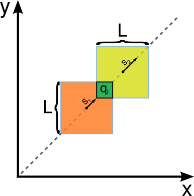

#Sherlock and Moving Tiles

Sherlock is given 2 square tiles, initially both of whose sides have length L placed in an x−y plane; so that the left bottom of each square coincides with the the origin and their sides are parallel to the axes.

At t=0, both squares start moving along line y=x (along the positive x and y) with velocities S1 and S2.

For each query of form qiqi, Sherlock has to report the time at which the overlapping area of tiles is equal to qiqi.

  

Note: Assume all values are in standard units.

##Input Format 
First line contains integers L,S1,S2L,S1,S2. Next line contains QQ, the number of queries. Each of the next QQ lines consists of one integer qiqi in one line.

##Constraints 
1≤L,S1,S2≤109  
1≤Q≤105  
1≤qi≤L2  
S1≠S2  

##Output Format 
For each query, print the required answer in one line. Your answer will be considered correct if it is at most 0.0001 away from the true answer. See the explanation for more details.

##Sample Input

```
10 1 2  
2  
50  
100  
```

##Sample Output

```
4.1421  
0.0000  
```

##Explanation

For the first case, note that the answer is around 4.1421356237..., so any of the following will be accepted:

```
4.1421356237  
4.14214  
4.14215000  
4.1421  
4.1422  
```

